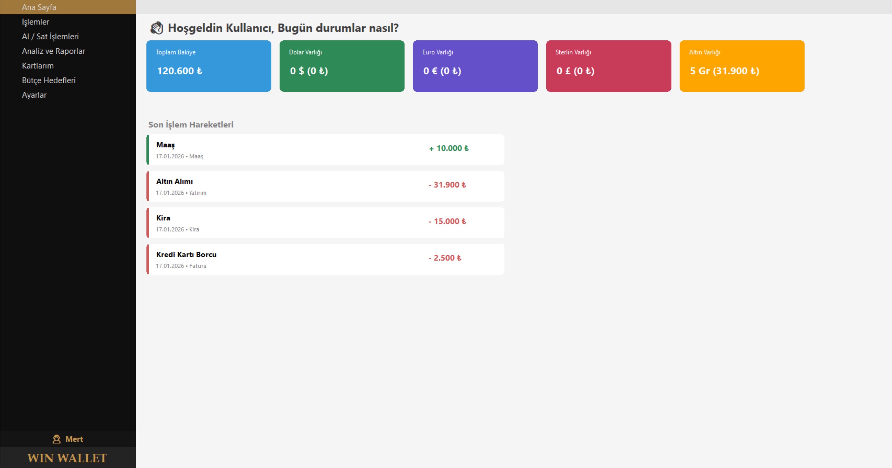
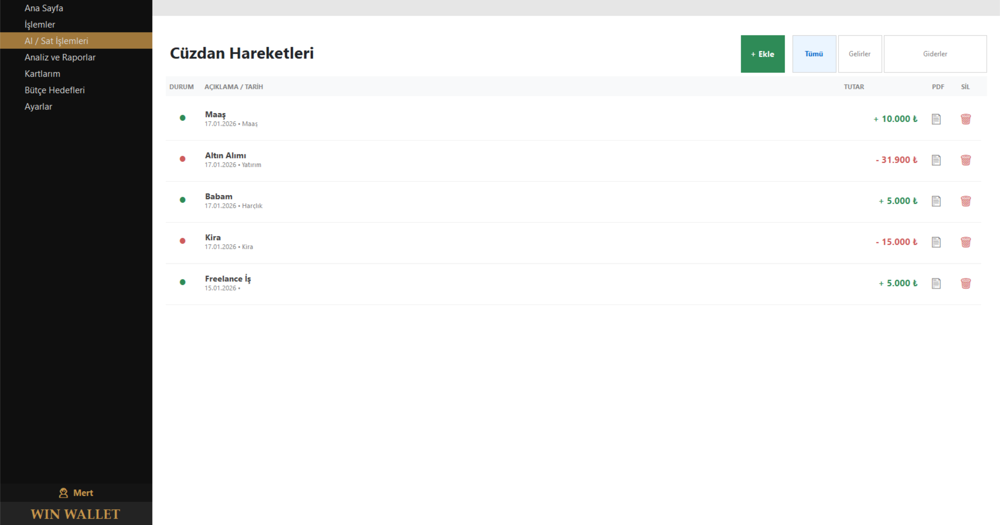

# 💸 Windows Wallet (Kişisel Finans & Ticaret Yönetimi)

Windows Wallet, kullanıcıların gelir-gider takibi yapmasını sağlayan ve sanal ticaret (trade) simülasyonu sunan modern bir Windows Forms uygulamasıdır.

## 📋 Proje Hakkında

Bu proje, standart bir bütçe takip uygulamasının ötesine geçerek, kullanıcıya varlıklarını yönetme ve sanal piyasada (Döviz, Altın vb.) al-sat yapma imkanı tanır. **Nesne Yönelimli Programlama (OOP)** prensiplerine sadık kalınarak geliştirilmiştir.

### 🚀 Öne Çıkan Özellikler

* **📊 Dashboard (Gösterge Paneli):** Toplam varlık, son işlemler ve finansal özetin tek ekranda görüntülenmesi.
* **💰 Gelir/Gider Yönetimi:** Harcamaların kategorize edilerek kayıt altına alınması.
* **📈 Ticaret (Trade) Simülasyonu:** Sanal bakiye ile güncel kurlar üzerinden al-sat yapabilme imkanı.
* **🎨 Modern Arayüz:** Standart Windows formları yerine, özel `Elips` yapısı ile yuvarlatılmış ve modern "Card UI" tasarımı.
* **📂 Taşınabilir Veritabanı:** SQLite altyapısı sayesinde kurulum gerektirmeden çalışır.
* **🔐 Güvenlik:** Kullanıcı kayıt ve giriş sistemi (Login/Register).

## 🛠 Kullanılan Teknolojiler

* **Dil:** C# (.NET Framework)
* **Arayüz:** Windows Forms (WinForms)
* **Veritabanı:** SQLite (System.Data.SQLite.Core)
* **Mimari:** Katmanlı Mimari & NYP (Kalıtım, Polimorfizm, Kapsülleme)

## 📷 Ekran Görüntüleri

| Dashboard | İşlem Ekleme |
|-----------|--------------|
|  |  |

*(Not: Buraya projenin ekran görüntülerini yükleyip linklerini koyabilirsiniz)*

## ⚙️ Kurulum ve Çalıştırma

Bu proje **SQLite** kullandığı için bilgisayarınıza SQL Server gibi harici uygulama kurmanıza gerek yoktur.

1.  Repoyu klonlayın veya `.zip` olarak indirin.
2.  `WindowsWallet.sln` dosyasını **Visual Studio 2022** ile açın.
3.  Solution Explorer üzerinde projeye sağ tıklayıp **"Rebuild"** diyerek NuGet paketlerinin (SQLite) yüklenmesini sağlayın.
4.  **Start** tuşuna basarak uygulamayı çalıştırın.

## 🤝 Katkıda Bulunanlar

* **Yusuf Taha ALICI** - *Database ve edit*
* **Ceyhun DALDAL** - *UI tasarımı*

---
